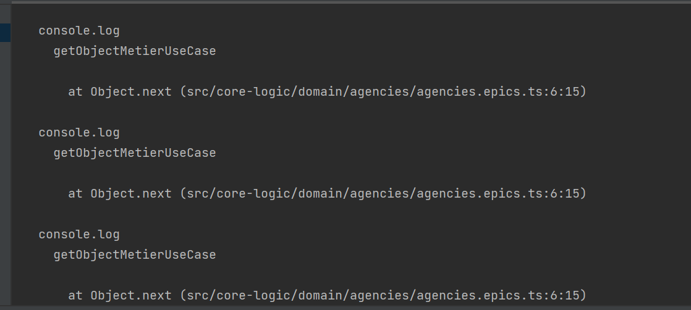
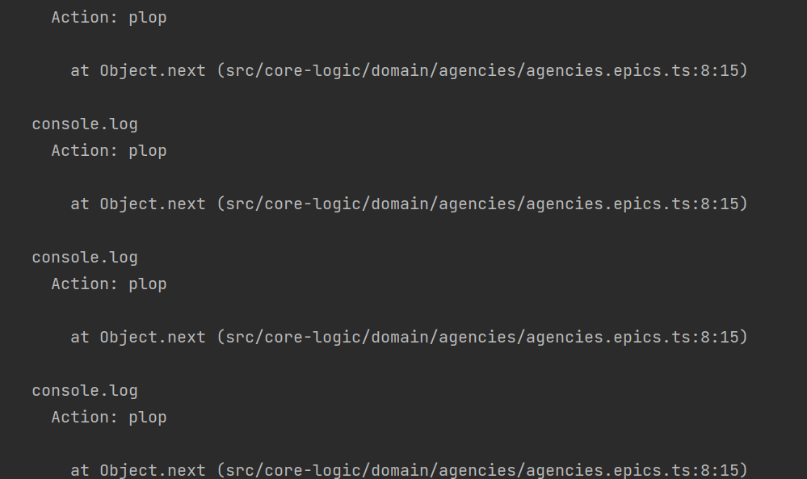

# Gestion d'état avec Redux Toolkit & redux-observables

## A propos

// TODO :
Expliquer grosse maille vocab et pourquoi on utilise ça
(useCase back = epic front ) Nous nous basons sur [redux-toolkit](https://redux-toolkit.js.org/)

## Ajouter une nouvelle gestion d'état

Dans le domaine, nous allons rajouter un epic utilisateur: 'Récupérer mes objets métiers'.

1. Créer un dossier dans [domain](front/src/core-logic/domain)

2. Un épique peut être résumé à une succession de changements d'état sur un flux d'événements (Observable). Nous implémentons cette notion d'épique via [Redux Observable](https://redux-observable.js.org/).

Dans sa version minimale il ne fait que logger un message lorsqu'il reçoit un déclencheur 'action'

Pour que l'epic soit enregistré sur redux il faut le rajouter à la liste
'allEpics' dans le store

### Déclencher l'epic

On veut voir quand cet epic est déclenché

```typescript
const getObjectMetierUseCase = (action$: Observable<AnyAction>) =>
  action$.pipe(
    tap(() => {
      console.log(`getObjectMetierUseCase`);
    }),
  );
```

code minimal de test:

```typescript
import { createTestStore } from "src/core-logic/storeConfig/createTestStore";
import { ReduxStore } from "src/core-logic/storeConfig/store";
import { AnyAction } from "@reduxjs/toolkit";

describe("Agencies in store", () => {
  let store: ReduxStore;

  beforeEach(() => {
    ({ store } = createTestStore());
  });

  it("agencies list should be initialState at start", () => {
    store.dispatch({
      type: "plop",
    } as AnyAction);
    expect(true).toBe(true);
  });
});
```

⚠️ En executant le test on voit que l'epic est déclenché en boucle car il réagit à toutes les actions du store.



Il faut donc restreindre son déclenchement à une action initiale qui corresponds au départ du cas métier

#### Comment savoir sur quoi filtrer ?

Dans son expression la plus simple une 'action' est un object caractérisé par une clef 'type'

```typescript
{
  type: "GetObjectMetierRequested";
}
```

On veut voir quand cet epic est déclenché qui contient la valeur de l'observable action

```typescript
const getObjectMetierUseCase = (action$: Observable<AnyAction>) =>
  action$.pipe(
    tap((action: AnyAction) => {
      console.log(`Action: ${action.type}`);
    }),
  );
```



### Déclencher l'epic "au bon moment" :)

On peut donc filtrer le déclenchement du use-case en vérifiant que l'action a été 'dispatch' par le store redux, en testant le type de l'action souhaitée.

```typescript
const getObjectMetierUseCase = (
  action$: Observable<AnyAction>,
  _state$,
  { conventionGateway },
) =>
  action$.pipe(
    filter((action) => action.type === "GetObjectMetierRequested"),
    tap(() => {
      console.log("getObjectMetierUseCase");
    }),
  );
```

## Ajouter une nouvelle slice ObjetMetier dans le store (redux-toolkit)

Pour gérer plus facilement les actions (et reducers) disponibles, nous avons choisi de l'implémenter avec Redux Toolkit, via la notion de [slice](https://redux-toolkit.js.org/api/createSlice).

### Créer notre test

Etat minimal avec les dépendances techniques pour redux toolkit.

```typescript
describe("my store slice", () => {
  let store: ReduxStore;
  let dependencies: TestDependencies;

  beforeEach(() => {
    ({ store, dependencies } = createTestStore());
  });
});
```

- Etude du store pour savoir ou rajouter la slice

## Prérequis pour avoir un état testable.

- 1. Créer une slice vide

Les trois notions qui nous intéressent sont :

- la description de la nature l'état (type)
- l'état initial
- une tranche minimale.AgencyState

```typescript
import { createSlice } from "@reduxjs/toolkit";

type ObjetMetier = {
  propriete: any;
};

// Au besoin on peut avoir un état complexe avec plusieurs notions.
type ObjetMetierState = {
  objects: ObjetMetier[];
  isLoading: boolean;
  errors: Error[];
};

const initialState: ObjetMetierState = {
  objects: [],
  isLoading: false,
};

export const objetMetierSlice = createSlice({
  name: "objectMetierName",
  initialState,
  reducers: {},
});
```

- 2. : Déclarer la slice dans le rootReducer dans [front/src/core-logic/storeConfig/store.ts](front/src/core-logic/storeConfig/store.ts)

```typescript
const rootReducer = combineReducers({
  [objetMetierSlice.name]: objetMetierSlice.reducer,
});
```

- 3. Créer test qui vérifie l'état initial de la slice

```typescript
describe("ObjetMetier in store", () => {
  let store: ReduxStore;
  let dependencies: TestDependencies;

  beforeEach(() => {
    ({ store, dependencies } = createTestStore());
  });

  it("object state should be initial state at start", () => {
    // add check not loading
    const expected = {
      objects: [],
      isLoading: false,
    };
    expectToEqual(store.getState().objetMetierName, expected);
  });
});
```

## On itère sur les test pour rajouter du comportement avec des actions

1. Créer test de l'action

```typescript
it("action should do something", () => {
  store.dispatch(objetMetierSlice.actions.myActionStartFetch());
  expect(agenciesSelector(store.getState())).toEqual(expected);
});
```

⚠️Le nom des actions disponibles dans la slice correspond aux clefs présentes dans les reducers préfixée par la slice (cf. Redux Toolkit) ⚠️

Ce qui explique ceci

```typescript
filter((action) => action.type === "agencies/fetchAgenciesRequested");
ou;
filter(agenciesSlice.actions.fetchAgenciesRequested.match); // (dans le monde redux-toolkit)
```

⚠️Et aussi le fait que des epics peuvent souscrire à des actions communes (par exemple [appIsReady](front/src/core-logic/domain/actions/appIsReady.action.ts))

2. Déclarer l'action
   Pour déclarer une action, on ajoute l'action en suivant le pattern [actionName]: (currentState, previousActionIfDefined) => ({ newState });

```typescript
export const objetMetierSlice = createSlice({
  name: "objectMetierName",
  initialState,
  reducers: {
    myActionStartFetch: (state) => ({
      ...state,
      isLoading: true,
    }),
  },
});
```

## Déclencher un use-case via son action initiale

Il est possible maintenant de déclencher un epic depuis (par exemple) un composant, en faisant un 'dispatch' de son action initiale.

eg: // TODO Mettre l'exemple une fois qu'on aura travaillé sur le composant

// TODO

- On veut rajouter un peu d'explication sur le typage
- On veut rajouter l'explication d'une action avec un payload
- On veut expliquer l'affectation du payload au state et ou l'action car c'est transverse.
